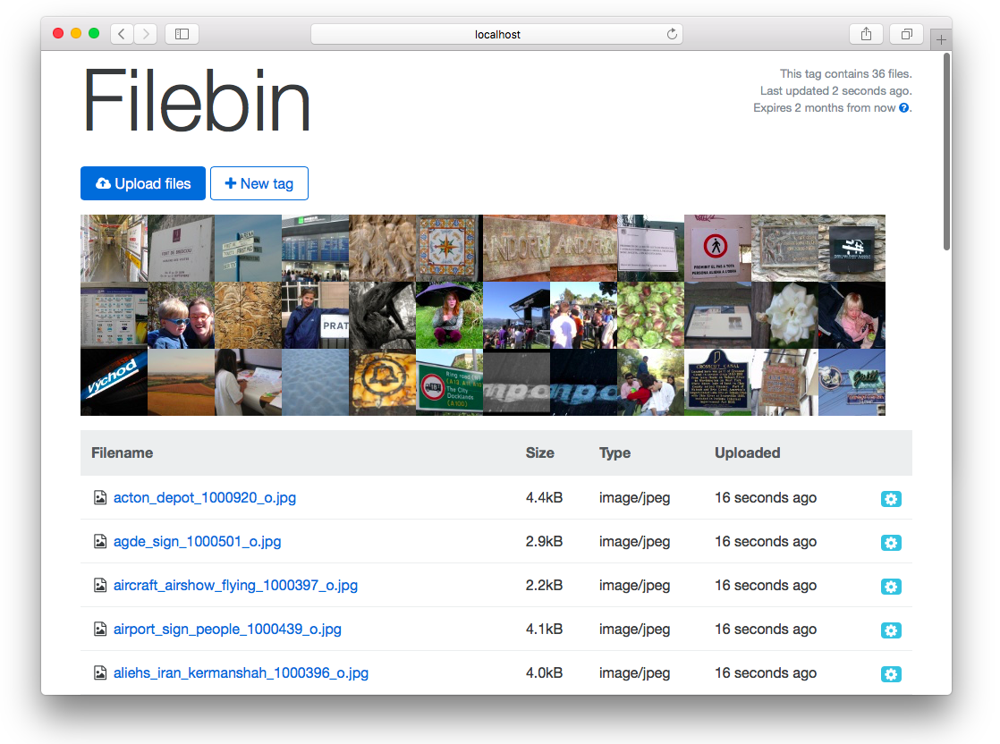
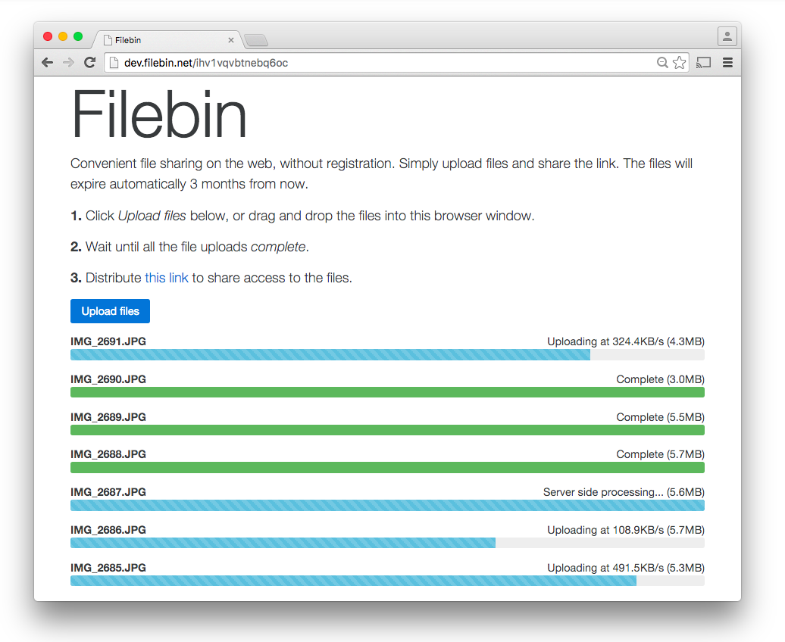

[](https://travis-ci.org/espebra/filebin)



Filebin is a web application that facilitates convenient file sharing over the web. This is the development branch of the next release that in the future will power [http://filebin.net](http://filebin.net).

## Table of contents

* [Requirements](#requirements)
* [Installation](#installation)
* [Configuration](#configuration)
* [Web interface](#web-interface)
* [Web service](#web-service)
* [TODO](#todo)

## Requirements

To build Filebin, a Golang build environment and some Golang packages are needed. The build procedure will produce a statically linked binary that doesn't require any external dependencies to run. It even comes with its own web server bundled.

It is recommended but not required to run it behind a TLS/SSL proxy such as [Hitch](http://hitch-tls.org/) and web cache such as [Varnish Cache](https://www.varnish-cache.org/). Example configurations for these are available below.

## Installation

Install Golang:

```
$ sudo yum/apt-get/brew install golang
```

Create the Go workspace and set the ``GOPATH`` environment variable:

```
$ mkdir ${HOME}/go
$ cd ${HOME}/go
$ mkdir src bin pkg
$ export GOPATH="${HOME}/go"
$ export PATH="${PATH}:${GOPATH}/bin"
```

Download and install Filebin:

```
$ go get -d github.com/espebra/filebin
$ cd ${GOPATH}/src/github.com/espebra/filebin
$ make get-deps
$ make install
```

The binary is created as ``${GOPATH}/bin/filebin``, which can be executed immediately. The ``--version`` argument prints the build time and the git commit hash used in the build.

```
$ ${GOPATH}/bin/filebin --version
Git Commit Hash: 40bd401ec350c86a46cdb3dc87f6b70c3c0b796b
UTC Build Time: 2015-11-11 23:01:35
```

Create the directories to use for storing files, logs and temporary files:

```
$ mkdir ~/filebin ~/filebin/files ~/filebin/logs ~/filebin/temp
```

## Configuration

Configuration is done using command line arguments when starting filebin. The built in help text will show the various arguments available:

```
$ ${GOPATH}/bin/filebin --help
```

Some arguments commonly used to start ``filebin`` are:

```
$ ${GOPATH}/bin/filebin \
  --host 0.0.0.0 --port 31337
  --baseurl http://api.example.com:31337
  --filedir ~/filebin/files \
  --tempdir ~/filebin/temp \
  --expiration 604800
  [...]
```

By default it will listen on ``127.0.0.1:31337``.

### Command line arguments

The following are elaborations on some of the command line arguments.

#### Baseurl

The ``--baseurl`` parameter is used when building [HATEOAS](https://en.wikipedia.org/wiki/HATEOAS) links in the JSON responses and to generate the correct hyperlinks in the HTML responses. If ``--baseurl`` is wrong, the required css and javascript resources will not load properly.

An example when having a TLS/SSL proxy in front on port 443 would be ``--baseurl https://filebin.example.com``.

It is also possible to run filebin from a subdirectory if specifying this accordingly with for example ``--baseurl https://www.example.com/filebin``.

A trailing slash is not needed.

#### Expiration

Tags expire after some time of inactivity. By default, tags will expire 3 months after the most recent file was uploaded. It is not possible to download files or upload more files to tags that are expired.

``--expiration 86400`` will expire tags 24 hours after the last file has been uploaded.

#### Triggers

Triggers enable external scripts to be executed at certain events.

##### New tag

The parameter ``--trigger-new-tag <command>`` makes sure ``<command> <tag>`` is executed whenever a new tag is being created. The execution is non-blocking. Example:

``--trigger-new-tag /usr/local/bin/new-tag`` will execute ``/usr/local/bin/new-tag <tagid>``.

##### Uploaded file

The parameter ``--trigger-uploaded-file <command>`` makes sure ``<command> <tag> <filename>`` is executed whenever a new file is uploaded. The execution is non-blocking. Example:

``--trigger-uploaded-file /usr/local/bin/uploaded-file`` will execute ``/usr/local/bin/uploaded-file <tagid> <filename>``.

## Web interface



## Web service

### Upload file

|			| Value				|
| --------------------- | ------------------------------|
| **Method**		| ``POST``			|
| **URL**		| /				|
| **URL parameters**	| *None*			|
| **Request body**	| File content in binary form	|
| **Success response**	| ``201``			|
| **Error response**	| ``400``			|

###### Examples

In all examples, the local file ``/path/to/some file`` will be uploaded.

Using the following command, the ``tag`` will be automatically generated and the ``filename`` will be set to the SHA256 checksum of the content. The checksum of the content will not be verified.

```
$ curl --data-binary "@/path/to/some file" http://localhost:31337/
```

Using the following command, ``tag`` will be set to ``customtag`` and ``filename`` will be set to ``myfile``.

```
$ curl --data-binary "@/path/to/some file" http://localhost:31337/ \
  -H "tag: customtag" -H "filename: myfile"
```

Using the following command, ``filebin`` will verify the checksum of the uploaded file and discard the upload if the checksum does not match the specified checksum:

```
$ curl --data-binary "@/path/to/some file" http://localhost:31337/ \
  -H "tag: customtag" -H "filename: myfile" \
  -H "content-sha256: 82b5f1d5d38641752d6cbb4b80f3ccae502973f8b77f1c712bd68d5324e67e33"
```

### Fetch tag details

|			| Value						|
| --------------------- | --------------------------------------------- |
| **Method**		| ``GET``					|
| **Request headers**	| ``content-type: application/json``		|
| **URL**		| /:tag						|
| **URL parameters**	| *None*					|
| **Success response**	| ``200``					|
| **Error response**	| ``404``					|

###### Examples

The following command will print a JSON structure showing which files that available in the tag ``customtag``.

```
$ curl http://localhost:31337/customtag
```

### Fetch tag as a zip archive

|			| Value						|
| --------------------- | --------------------------------------------- |
| **Method**		| ``GET``					|
| **Request headers**	| ``content-type: application/zip``		|
| **URL**		| /:tag						|
| **URL parameters**	| o=zip						|
| **Success response**	| ``200``					|
| **Error response**	| ``404``					|

###### Examples

The following commands will download the files in ``customtag`` as a zip archive:

```
$ curl http://localhost:31337/customtag?o=zip
$ curl -H "content-type: application/zip" http://localhost:31337/customtag
```

### Download file

|			| Value			|
| --------------------- | ----------------------|
| **Method**		| ``GET``		|
| **URL**		| /:tag/:filename	|
| **URL parameters**	| *None*		|
| **Success response**	| ``200``		|
| **Error response**	| ``404``		|

###### Examples

Downloading a file is as easy as specifying the ``tag`` and the ``filename`` in the request URI:

```
$ curl http://localhost:31337/customtag/myfile
```

### Delete file

|			| Value			|
| --------------------- | ----------------------|
| **Method**		| ``DELETE``		|
| **URL**		| /:tag/:filename	|
| **URL parameters**	| *None*		|
| **Success response**	| ``200``		|
| **Error response**	| ``404``		|

### Delete tag

|			| Value			|
| --------------------- | ----------------------|
| **Method**		| ``DELETE``		|
| **URL**		| /:tag			|
| **URL parameters**	| *None*		|
| **Success response**	| ``200``		|
| **Error response**	| ``404``		|

###### Examples

```
$ curl -X DELETE http://localhost:31337/customtag/myfile
```

## Logging

All logs are written to stdout. They can easily be redirected to for example syslog when using the [systemd service script provided](systemd/filebin.service).

## Database

Filebin does currently not use any other database than the filesystem itself.

## TODO

These are feature that would be nice to have:

* Automatically clean up expired tags.
* Avoid reuse of expired tags.
* Support for deleting entires tags.
* Support for deleting single files (already in the API).
* Streaming of entire (on the fly) compressed tags.
* Thumbnail generation.
* Image meta data (EXIF) extraction.
* Administrator dashboard.
