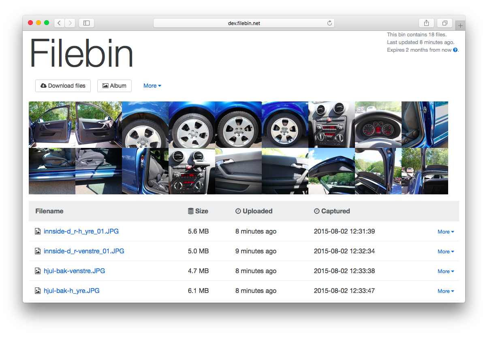
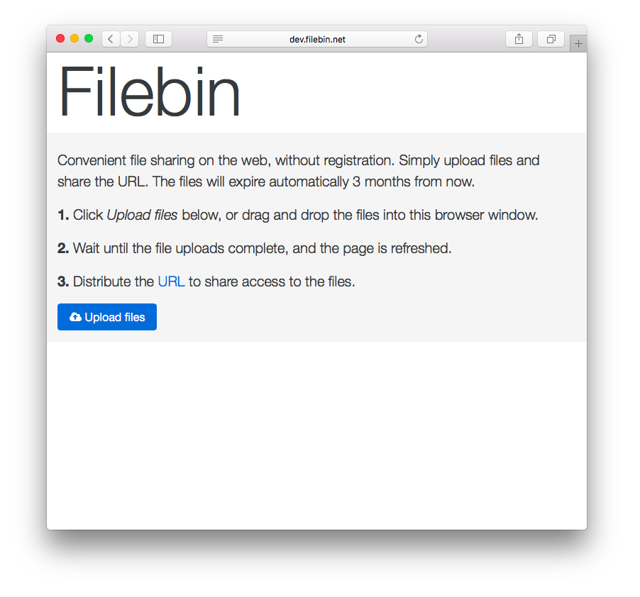

[](https://travis-ci.org/espebra/filebin)



Filebin is a web application that facilitates convenient file sharing over the web. It is the software that makes [http://filebin.net](http://filebin.net) possible.

## Table of contents

* [Features](#features)
* [Requirements](#requirements)
* [Installation](#installation)
* [Configuration](#configuration)
* [Web interface](#web-interface)
* [Web service](#web-service)
* [Development](#development)
* [TODO](#todo)

## Features

* Responsive and mobile friendly [web interface](#web-interface).
* All functionality available through an [HTTP API](#web-service).
* Upload files using drag and drop, select files from a dialog box or use cURL ([examples below](#web-service))
* Large file support. 10 GB file upload has been tested, but it should work fine with larger files as well.
* Archive (tar and zip) download to make it easy to download multiple files in one go.
* Files expire automatically after a configurable period of time.
* Files and entire bins can be deleted manually.
* Thumbnails are displayed for image files.
* Album view is available in bins with images. Images are sorted based on the Exif DateTime timestamps.
* Triggers are capable of calling external scripts on certain events. One potential use case is to notify virus/malware scanners on file upload.
* No external dependencies once built.
* Cache invalidation support.

## Requirements

To build Filebin, a Golang build environment and some Golang packages are needed. The build procedure will produce a statically linked binary that doesn't require any external dependencies to run. It even comes with its own web server bundled.

It is recommended but not required to run it behind a TLS/SSL proxy such as [Hitch](http://hitch-tls.org/) and web cache such as [Varnish Cache](https://www.varnish-cache.org/). Example configurations for these [are provided](etc/).

## Installation

Install Golang:

```bash
$ sudo yum/apt-get/brew install golang
```

Create the Go workspace and set the ``GOPATH`` environment variable:

```bash
$ mkdir ${HOME}/go
$ cd ${HOME}/go
$ mkdir src bin pkg
$ export GOPATH="${HOME}/go"
$ export PATH="${PATH}:${GOPATH}/bin"
```

Download and install Filebin:

```bash
$ go get -d github.com/espebra/filebin
$ cd ${GOPATH}/src/github.com/espebra/filebin
$ make get-deps
$ make install
```

The binary is created as ``${GOPATH}/bin/filebin``, which can be executed immediately. The ``--version`` argument prints the build time and the git commit hash used in the build.

```bash
$ ${GOPATH}/bin/filebin --version
Git Commit Hash: 40bd401ec350c86a46cdb3dc87f6b70c3c0b796b
UTC Build Time: 2015-11-11 23:01:35
```

Create the directories to use for storing files and temporary files:

```bash
$ mkdir ~/filebin ~/filebin/files ~/filebin/temp
```

## Configuration

Configuration is done using command line arguments when starting filebin. The built in help text will show the various arguments available:

```bash
$ ${GOPATH}/bin/filebin --help
```

Some arguments commonly used to start ``filebin`` are:

```bash
$ ${GOPATH}/bin/filebin \
  --host 0.0.0.0 --port 31337
  --baseurl http://api.example.com:31337
  --filedir ~/filebin/files \
  --tempdir ~/filebin/temp \
  --expiration 604800 \
  --cache-invalidation \
  --admin-username admin \
  --admin-password changeme \
  --client-address-header x-client \
  [...]
```

By default it will listen on ``127.0.0.1:31337``.

### Command line arguments

The following are elaborations on some of the command line arguments.

#### Baseurl

The ``--baseurl`` parameter is used when building [HATEOAS](https://en.wikipedia.org/wiki/HATEOAS) links in the JSON responses and to generate the correct hyperlinks in the HTML responses. If ``--baseurl`` is wrong, the required css and javascript resources will not load properly.

An example when having a TLS/SSL proxy in front on port 443 would be ``--baseurl https://filebin.example.com``.

It is also possible to run filebin from a subdirectory if specifying this accordingly with for example ``--baseurl https://www.example.com/filebin``.

A trailing slash is not needed.

#### Expiration

Bins expire after some time of inactivity. By default, bins will expire 3 months after the most recent file was uploaded. It is not possible to download files or upload more files to bins that are expired.

``--expiration 86400`` will expire bins 24 hours after the last file has been uploaded.

#### Cache invalidation

Enabled with the parameter ``--cache-invalidation``. When enabled, HTTP PURGE requests will be sent to baseurl/path for every change to ensure content is invalidated on any frontend web cache.

#### Client Address Header

The parameter ``--client-address-header`` can specify a request header to read the original client IP address from. This might be useful if having one or more proxies on layer 7 in front of the filebin daemon.

#### Admin username and password

The parameters ``--admin-username`` and ``--admin-password`` will, if set, enable the administrator page. It is available at the URL baseurl/admin, with the specified username and password for login.

#### Triggers

Triggers enable external scripts to be executed at certain events.

##### New bin

The parameter ``--trigger-new-bin <command>`` makes sure ``<command> <bin>`` is executed whenever a new bin is being created. The execution is non-blocking. Example:

``--trigger-new-bin /usr/local/bin/new-bin`` will execute ``/usr/local/bin/new-bin <binid>``.

##### Upload file

The parameter ``--trigger-upload-file <command>`` makes sure ``<command> <bin> <filename>`` is executed whenever a new file is uploaded. The execution is non-blocking. Example:

``--trigger-upload-file /usr/local/bin/upload-file`` will execute ``/usr/local/bin/upload-file <binid> <filename>``.

##### Download bin

The parameter ``--trigger-download-bin <command>`` makes sure ``<command> <bin>`` is executed whenever a bin is downloaded as an archive. The execution is non-blocking. Example:

``--trigger-download-bin /usr/local/bin/download-bin`` will execute ``/usr/local/bin/download-bin <binid>``.

##### Download file

The parameter ``--trigger-download-file <command>`` makes sure ``<command> <bin> <filename>`` is executed whenever a file is downloaded. The execution is non-blocking. Example:

``--trigger-download-file /usr/local/bin/download-file`` will execute ``/usr/local/bin/download-file <binid> <filename>``.

##### Delete bin

The parameter ``--trigger-delete-bin <command>`` makes sure ``<command> <bin>`` is executed whenever a bin is deleted. The execution is non-blocking. Example:

``--trigger-delete-bin /usr/local/bin/delete-bin`` will execute ``/usr/local/bin/delete-bin <binid>``.

##### Delete file

The parameter ``--trigger-delete-file <command>`` makes sure ``<command> <bin> <filename>`` is executed whenever a file is deleted. The execution is non-blocking. Example:

``--trigger-delete-file /usr/local/bin/delete-file`` will execute ``/usr/local/bin/delete-file <binid> <filename>``.

## Web interface

### Create new bin / empty bin



### File uploads in progress


### View bin with files


## Web service

### Upload file

|			| Value						|
| --------------------- | ----------------------------------------------|
| **Method**		| ``POST``					|
| **URL**		| /						|
| **URL parameters**	| *None*					|
| **Request headers**	| ``filename``, ``bin``, ``content-sha256``	|
| **Request body**	| File content in binary form			|
| **Success response**	| ``201``					|
| **Error response**	| ``400``					|

###### Examples

In all examples, the local file ``/path/to/some file`` will be uploaded.

Using the following command, the ``bin`` will be automatically generated and the ``filename`` will be set to the SHA256 checksum of the content. The checksum of the content will not be verified.

```bash
$ curl --data-binary "@/path/to/some file" https://filebin.example.com/
```

Using the following command, ``bin`` will be set to ``custombin`` and ``filename`` will be set to ``myfile``.

```bash
$ curl --data-binary "@/path/to/some file" https://filebin.example.com/ \
  -H "bin: custombin" -H "filename: myfile"
```

Using the following command, ``filebin`` will verify the checksum of the uploaded file and discard the upload if the checksum does not match the specified checksum:

```bash
$ curl --data-binary "@/path/to/some file" https://filebin.example.com/ \
  -H "bin: custombin" -H "filename: myfile" \
  -H "content-sha256: 82b5f1d5d38641752d6cbb4b80f3ccae502973f8b77f1c712bd68d5324e67e33"
```

### Fetch bin details

|			| Value						|
| --------------------- | --------------------------------------------- |
| **Method**		| ``GET``					|
| **URL**		| /:bin						|
| **URL parameters**	| *None*					|
| **Request headers**	| ``Accept: application/json``		|
| **Request body**	| *None*					|
| **Success response**	| ``200``					|
| **Error response**	| ``404``					|

###### Examples

The following command will print a JSON structure showing which files that available in the bin ``custombin``.

```bash
$ curl -H "Accept: application/json" https://filebin.example.com/custombin
```

### Fetch bin as an archive

|			| Value						|
| --------------------- | --------------------------------------------- |
| **Method**		| ``GET``					|
| **URL**		| /:archive/:bin/:format			|
| **URL parameters**	| *None*					|
| **Request headers**	| *None*					|
| **Request body**	| *None*					|
| **Success response**	| ``200``					|
| **Error response**	| ``404``					|

###### Examples

The following commands will download the files in ``custombin`` as tar and zip archives:

```bash
# Tar
$ curl -o custombin.tar https://filebin.example.com/archive/custombin/tar

# Zip
$ curl -o custombin.zip https://filebin.example.com/archive/custombin/zip
```

### Download file

|			| Value			|
| --------------------- | ----------------------|
| **Method**		| ``GET``		|
| **URL**		| /:bin/:filename	|
| **URL parameters**	| *None*		|
| **Request headers**	| *None*		|
| **Request body**	| *None*		|
| **Success response**	| ``200``		|
| **Error response**	| ``404``		|

###### Examples

Downloading a file is as easy as specifying the ``bin`` and the ``filename`` in the request URI:

```bash
$ curl https://filebin.example.com/custombin/myfile
```

### Delete file

|			| Value			|
| --------------------- | ----------------------|
| **Method**		| ``DELETE``		|
| **URL**		| /:bin/:filename	|
| **URL parameters**	| *None*		|
| **Request headers**	| *None*		|
| **Request body**	| *None*		|
| **Success response**	| ``200``		|
| **Error response**	| ``404``		|

### Delete bin

|			| Value			|
| --------------------- | ----------------------|
| **Method**		| ``DELETE``		|
| **URL**		| /:bin			|
| **URL parameters**	| *None*		|
| **Request headers**	| *None*		|
| **Request body**	| *None*		|
| **Success response**	| ``200``		|
| **Error response**	| ``404``		|

###### Examples

```bash
$ curl -X DELETE https://filebin.example.com/custombin/myfile
```

## Logging

Logs are written to stdout, and can easily be redirected to for example syslog when using the [systemd service script provided](etc/systemd/filebin.service.example).

## Database

Filebin does currently not use any other database than the filesystem itself.

## Development

### Git hooks

There is a pre-commit hook available in the repository that will make sure that commited go source code is properly formatted. Enable it with a symlink:

```bash
$ ln -s tools/git/pre-commit .git/hooks/pre-commit
```

## TODO

* Automatically clean up expired bins.
* Avoid reuse of expired bins.
* Trigger cache invalidation on bin expiration.
